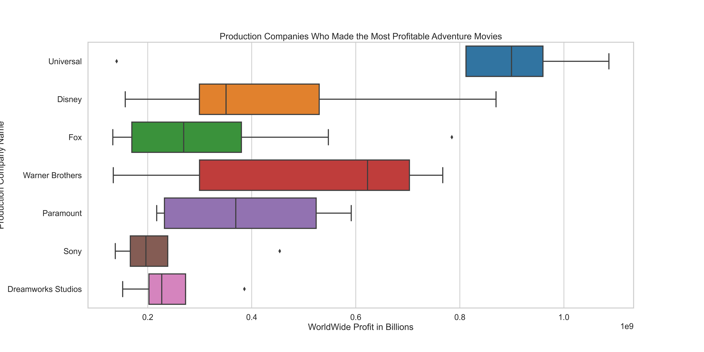

# Microsoft Movie Project
## Authors: Helen Abele, Jerry Hudspeth, Josh Hill

## Overview
### Microsoft applied us the job of letting their stakeholders know how to make a successful movie. We were given data that we were to organize so that Microsoft can make an informed decision. To decipher all the data we used SQL, Pandas, and Seaborn. All of which are through the Python library. With the given data we concluded that the most profitable genre is Adventure. We then followed this up by finding the best directors in the adventure genre. Using the IMBD and TMBD databases, we were able to find who has directed the most adventure movies and who has directed the most profitable adventure movie. With this data, we concluded that Microsoft should create an adventure movie directed by Kyle Badla.

## Business Problem
### The main point for our business's project is that we want Microsoft to be profitable as possible in this movie venture. At first look at the data, we realized that just looking at movies would be too broad, so we then decided to look at the genre. After finding the most profitable genre, we then decided to look further into what made that genre so profitable. We started by looking at the popular actors in that genre but quickly realized that we did not have enough data to support this venture. This led us at looking at which director was the most successful in the adventure genre. We deemed these questions important because, at the end of the day, a company measures success on how much money they make, and we concluded that an adventure movie would make Microsoft the most money.

## Data
### The data we used in making this proposal came from IMDB, TheMovieDB.org, and Rotten Tomatoes. This data helped us discover our target variable, worldwide profit. Once the data was cleaned, we used things such as run time, Average Vote from TMBD, and most profitable genre to present our variable.

## Methods
### In order to analyze our data, we used the Python libraries and the tools, SQL, Pandas, and Seaborn. We used SQL for database queries, Pandas for cleaning and filtering, and Seaborn for our visuals. These methods helped us present our data in the best way possible. With the data analysis tools, we were able to seamlessly analyze the data for our project.

## Visuals

## Conclusion
